# Guia de testes

Passo a passo pra subir o sistema e testar na mão — Swagger (identity) + GraphiQL (scheduling e
history) — do zero até a consulta aparecer no histórico. Cada passo mostra o que você deve
receber de volta, então dá pra conferir se deu certo antes de seguir pro próximo.

> Veja também: [`README.md`](README.md) (arquitetura, regras de negócio) e
> [`arquitetura-sistemas.drawio`](arquitetura-sistemas.drawio) (diagrama de componentes).

## Portas (com Docker up)

| Serviço | URL |
|---|---|
| identity (Swagger) | http://localhost:8080/swagger-ui.html |
| scheduling (GraphiQL) | http://localhost:8085/graphiql |
| notification | http://localhost:8082 |
| history (GraphiQL) | http://localhost:8083/graphiql |
| RabbitMQ (painel) | http://localhost:15672 (guest/guest) |
| Kafka UI | http://localhost:8084 |
| Adminer | http://localhost:8090 (root/root) |
| Allure (relatório de testes) | ver URL de cada serviço no [passo 10](#10-ver-o-relatório-de-testes-allure) |

## Quem precisa de qual token

| Ação | Token necessário |
|---|---|
| Login / refresh | nenhum |
| Criar usuário (`POST /users`) | ADMIN |
| `scheduleAppointment` | DOCTOR ou NURSE |
| `editAppointment` | DOCTOR dono do agendamento |
| `history` / `futureAppointments` | DOCTOR, NURSE ou PATIENT |

Tokens de acesso expiram em 1h — se der 401 do nada, é só refazer o login do passo
correspondente.

---

## 0. Subir o sistema

Token: nenhum.

```bash
git clone --recurse-submodules <url-deste-repo>
cd hospital-system

# gera o par de chaves RSA uma vez, copia a pública pra cada serviço
openssl genpkey -algorithm RSA -pkeyopt rsa_keygen_bits:2048 -out keys/private.pem
openssl rsa -in keys/private.pem -pubout -out keys/public.pem
cp keys/private.pem identity-service/src/main/resources/private.pem
cp keys/public.pem  identity-service/src/main/resources/public.pem
cp keys/public.pem  scheduling-service/src/main/resources/public.pem
cp keys/public.pem  history-service/src/main/resources/public.pem

docker compose up --build -d
docker compose logs -f identity scheduling notification history
```

Quer começar 100% do zero (apagar os bancos também)? Rode `docker compose down -v` antes
do `up`. Pra parar tudo no final: `docker compose down`.

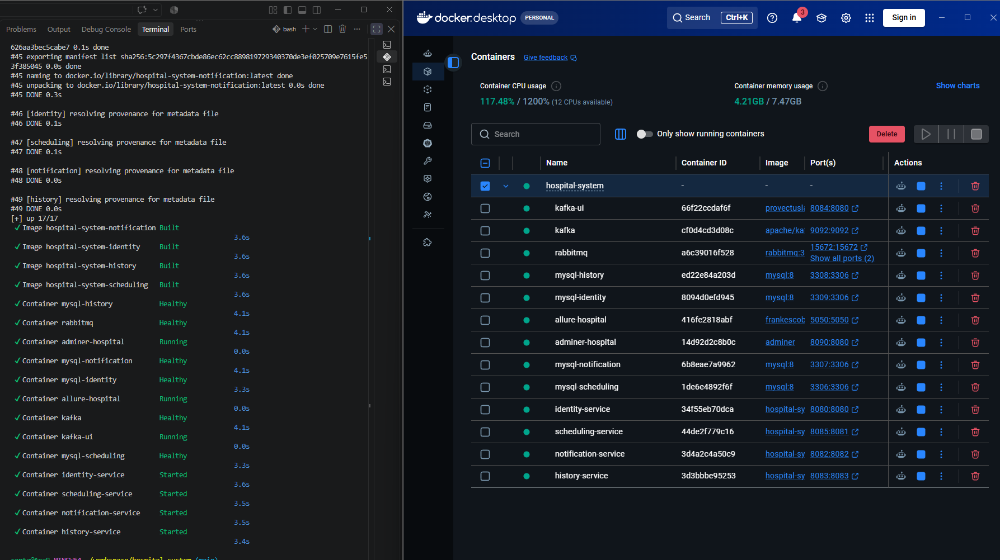

## 1. Login como admin

Token: nenhum.

**Não precisa criar o admin** — o `AdminSeeder` já cria esse usuário sozinho na primeira
vez que o `identity-service` sobe.

Swagger: `localhost:8080/swagger-ui.html` → `POST /auth/login`

```json
{
  "email": "admin@hospital.local",
  "password": "admin12345"
}
```

**Guarde:** o `accessToken` da resposta → chame de **token ADMIN** (vale 1h).

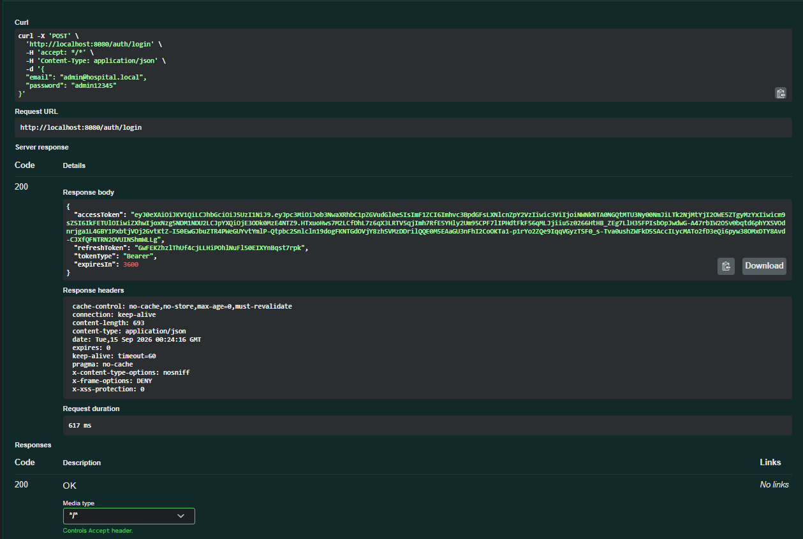

## 2. Criar um DOCTOR

Token: ADMIN.

No Swagger, clique em **Authorize** e cole o token ADMIN do passo 1.

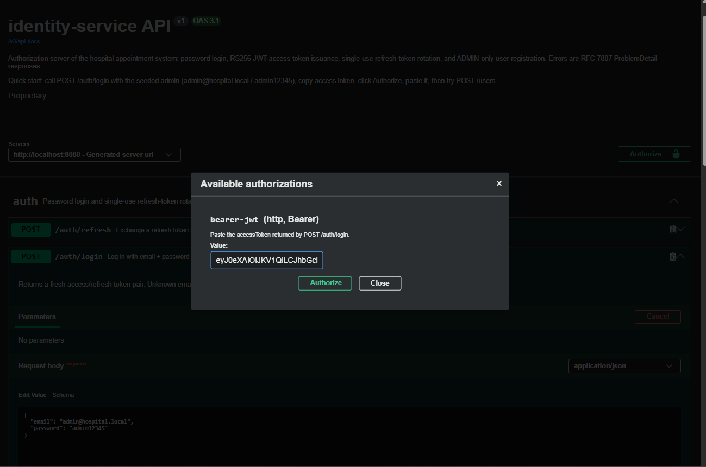

Depois: `POST /users`

```json
{
  "email": "dr.silva@hospital.local",
  "password": "secret123",
  "role": "DOCTOR",
  "fullName": "Dra. Ana Silva",
  "crm": "12345-SP",
  "specialty": "Cardiologia"
}
```

**Guarde:** o `id` da resposta → chame de **doctorId**.

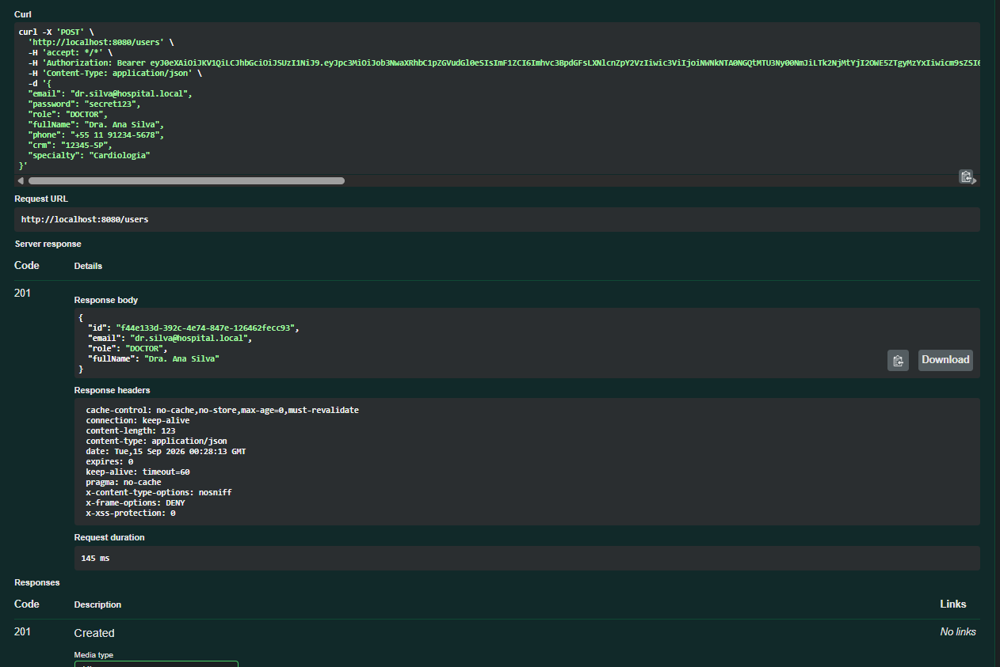

## 3. Criar um PATIENT

Token: ADMIN (mesmo do passo 1, ainda no ar).

`POST /users` de novo:

```json
{
  "email": "paciente.teste@hospital.local",
  "password": "secret123",
  "role": "PATIENT",
  "fullName": "Paciente Teste"
}
```

**Guarde:** o `id` da resposta → chame de **patientId**.

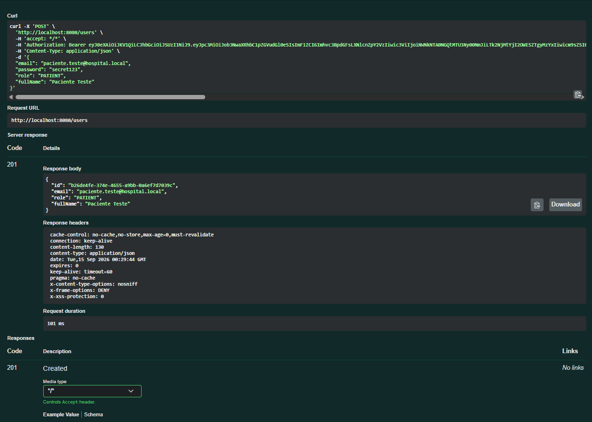

## 4. Login como o DOCTOR

Token: nenhum.

> ⚠️ O token ADMIN não roda mutation nenhuma no scheduling — só serve pra criar usuário.
> A partir daqui você precisa do token do médico.

`POST /auth/login` de novo, agora com o doctor:

```json
{
  "email": "dr.silva@hospital.local",
  "password": "secret123"
}
```

**Guarde:** o `accessToken` → chame de **token DOCTOR** (vale 1h).

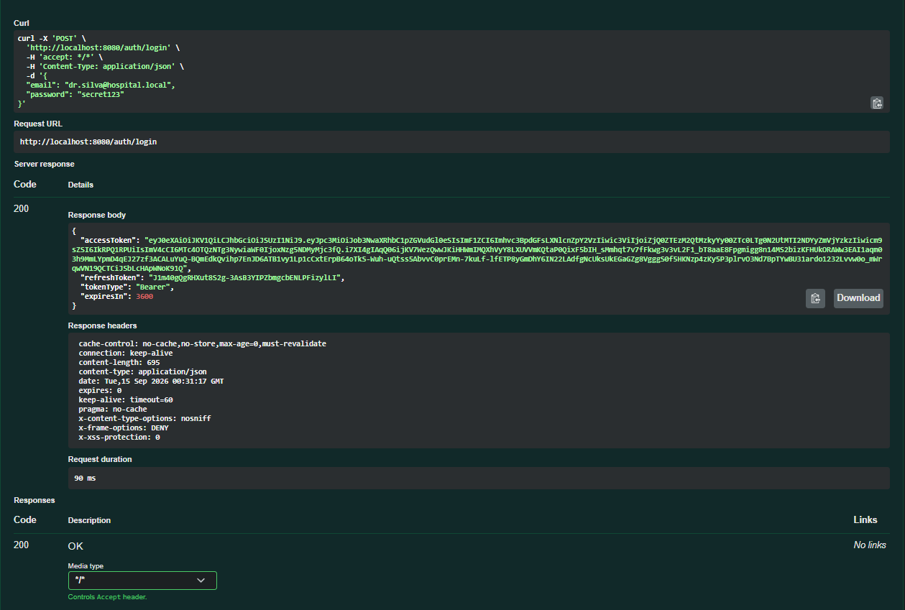

## 5. Agendar a consulta

Token: DOCTOR.

GraphiQL do scheduling: `localhost:8085/graphiql` (essa mutation já vem numa aba pronta).
No painel Headers:

```json
{ "Authorization": "Bearer <token DOCTOR>" }
```

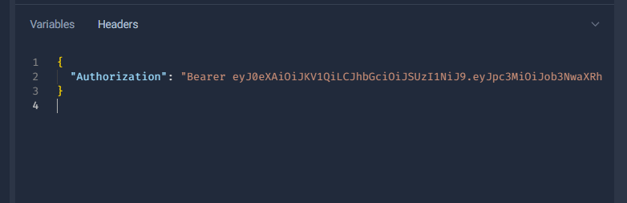

Query:

```graphql
mutation ScheduleAppointment($input: ScheduleInput!) {
  scheduleAppointment(input: $input) {
    id patientId doctorId scheduledAt status
  }
}
```

Variables — troque pelos IDs dos passos 2 e 3:

```json
{
  "input": {
    "patientId": "<patientId do passo 3>",
    "doctorId": "<doctorId do passo 2>",
    "scheduledAt": "2026-11-01T10:00:00"
  }
}
```

Resposta esperada:

```json
{ "data": { "scheduleAppointment": {
  "id": "9c747508-de33-4be7-9da7-b76e386b2492",
  "status": "SCHEDULED", "...": "..." } } }
```

**Guarde:** o `id` → chame de **appointmentId**.

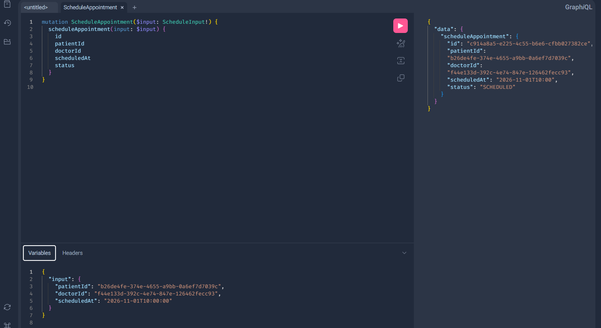

## 6. Conferir o e-mail simulado

Token: nenhum.

```bash
docker compose logs notification --tail 20
```

Linha esperada no log:

```
Simulated e-mail sent to Paciente Teste <paciente.teste@hospital.local>
 — subject: "Lembrete: sua consulta em 01/11/2026 às 10:00"
```

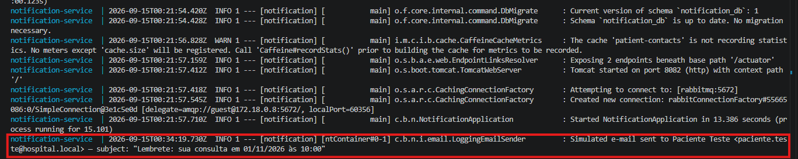

Bônus: em `localhost:15672` (guest/guest), a fila `reminder.queue` deve estar de volta em
zero — foi consumida.

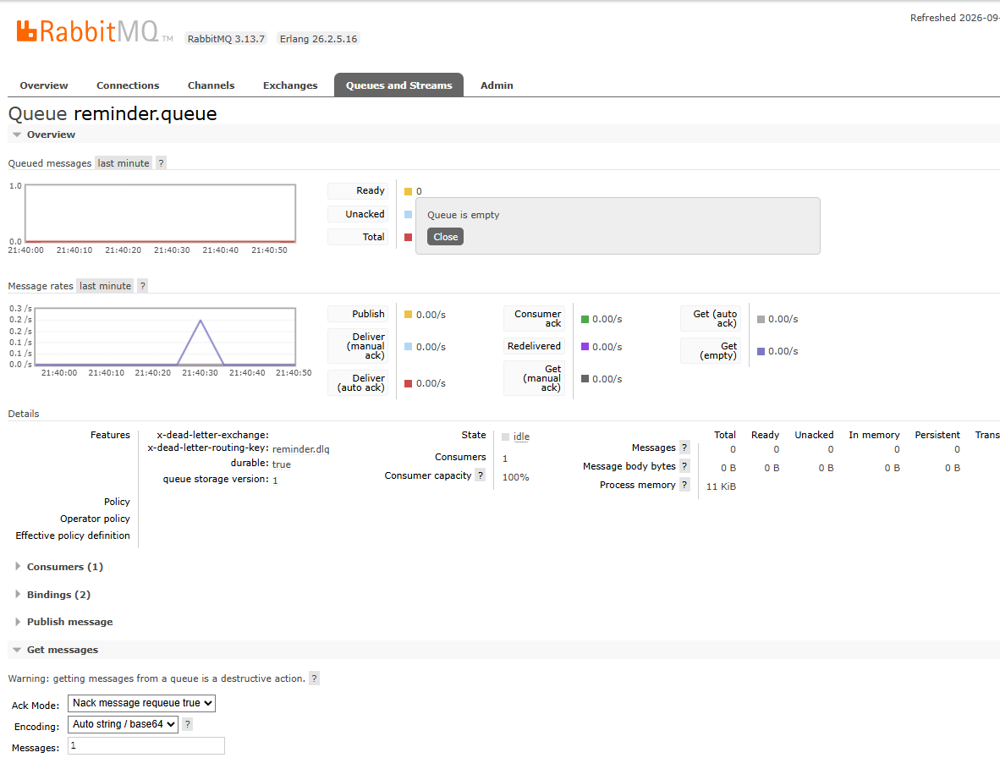

## 7. Conferir o histórico

Token: DOCTOR, NURSE ou PATIENT (pode reusar o token DOCTOR do passo 4).

GraphiQL do history: `localhost:8083/graphiql`

Query:

```graphql
query History($patientId: ID) {
  history(patientId: $patientId) {
    id patientName doctorName scheduledAt status
  }
}
```

Variables:

```json
{ "patientId": "<patientId do passo 3>" }
```

Resposta esperada:

```json
{ "data": { "history": [{
  "patientName": "Paciente Teste",
  "doctorName": "Dra. Ana Silva",
  "status": "SCHEDULED" }] } }
```

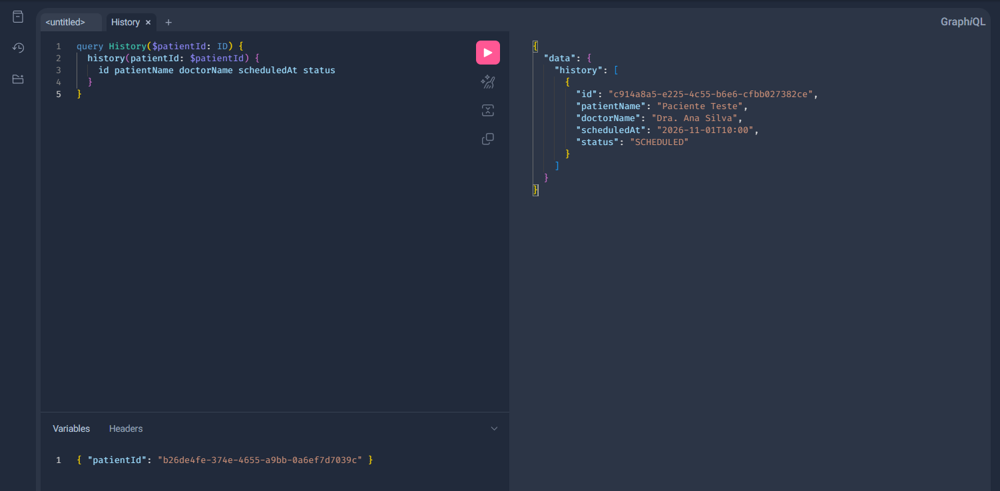

## 8. Editar / cancelar (opcional)

Token: DOCTOR dono do agendamento (mesmo token do passo 4).

De volta no GraphiQL do scheduling — só quem criou o agendamento pode editar:

```graphql
mutation EditAppointment($input: EditInput!) {
  editAppointment(input: $input) { id status scheduledAt }
}
```

Variables — `appointmentId` do passo 5:

```json
{
  "input": {
    "appointmentId": "<appointmentId do passo 5>",
    "status": "CANCELLED"
  }
}
```

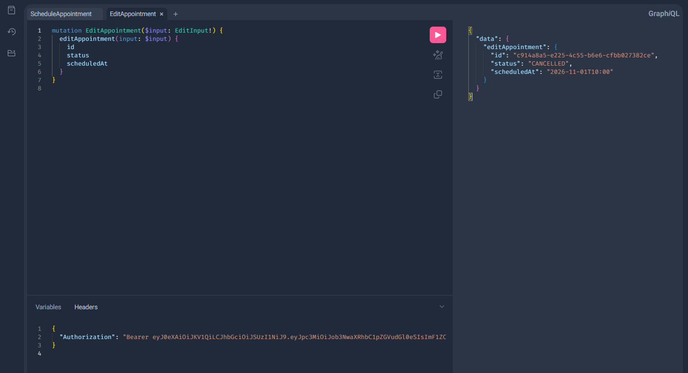

Bônus: tanto o agendamento (passo 5) quanto essa edição publicam no tópico Kafka
`appointment-events` (`AppointmentCreated` e `AppointmentUpdated` — é esse evento que o
`history-service` consome pra montar o histórico do passo 7). Pra ver as duas mensagens já
publicadas, abra o Kafka UI em `localhost:8084` → **Topics** → `appointment-events` →
**Messages**.

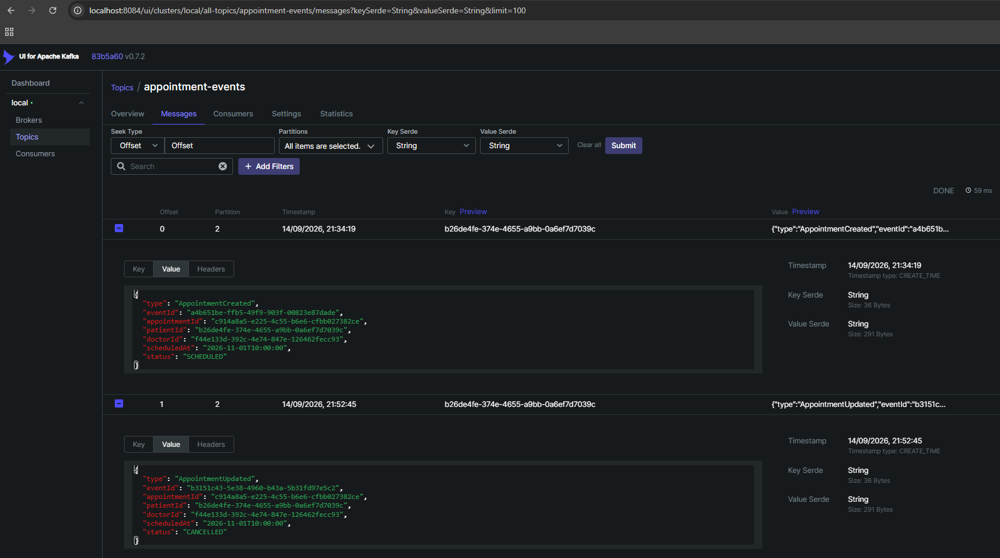

Bônus: refaça a query do passo 7 (mesmas variables) — o `status` deve vir `CANCELLED` agora,
prova de que o `history-service` consumiu o `AppointmentUpdated` do Kafka.

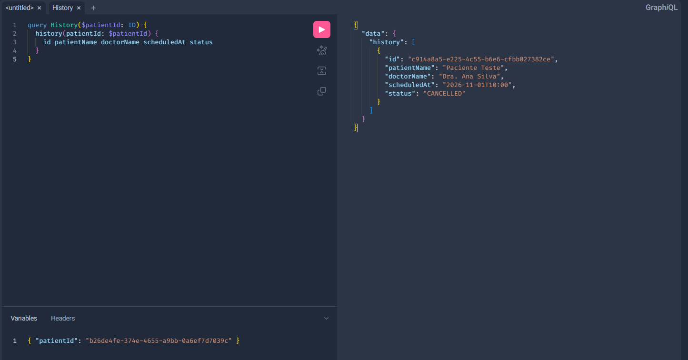

## 9. Ver direto no banco (opcional)

Token: nenhum.

O `docker-compose.yml` da raiz sobe um Adminer só, compartilhado pelos 4 bancos:
`adminer-hospital` na porta `8090:8080` (host `8090` → container `8080`). Acesse
`localhost:8090`.

Cada MySQL é um container/servidor separado — o Adminer conecta em **um por vez**, então
no formulário de login preencha **Servidor** e **Base de dados** juntos (usuário/senha são
sempre os mesmos):

| Servidor | Base de dados | Usuário | Senha |
|---|---|---|---|
| `mysql-identity` | `identity_db` | `root` | `root` |
| `mysql-scheduling` | `scheduling_db` | `root` | `root` |
| `mysql-notification` | `notification_db` | `root` | `root` |
| `mysql-history` | `history_db` | `root` | `root` |

> ⚠️ O erro mais comum aqui é trocar só o campo **Base de dados** e esquecer de trocar o
> **Servidor** junto — aí dá "banco inválido", porque esse banco não existe dentro do
> servidor errado. Os dois campos sempre andam juntos, em pares, como na tabela acima.

Pra trocar de banco depois de já estar logado num, é só fazer login de novo escolhendo o
próximo par da tabela — o Adminer não mostra os 4 ao mesmo tempo numa sessão só.

Também dá pra consultar direto pela linha de comando, sem abrir o navegador:

```bash
docker exec mysql-history mysql -uroot -proot history_db -e "SELECT * FROM appointment_history;"
```

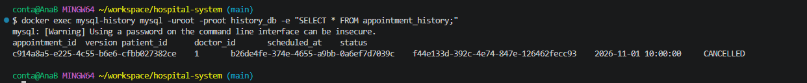

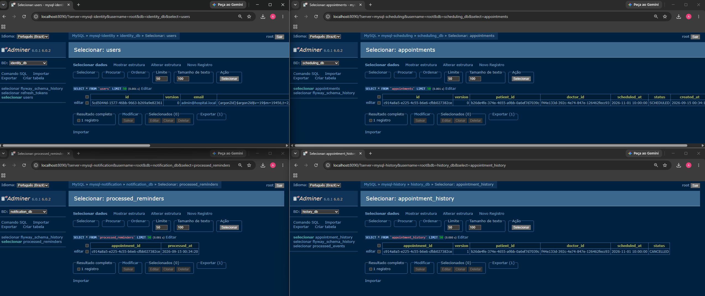

## 10. Ver o relatório de testes (Allure)

Token: nenhum.

O container do Allure já subiu junto com o resto lá no passo 0 (`docker compose up --build
-d`) — ele fica de olho nos resultados de teste dos 4 serviços e monta o relatório sozinho,
sem precisar instalar nada.

Rode os testes de um serviço:

```bash
cd <service>     # identity-service | scheduling-service | notification-service | history-service
./mvnw verify
```

Espere uns 5s (intervalo de checagem do container) e abra o relatório:

| Serviço | URL do relatório |
|---|---|
| identity | http://localhost:5050/allure-docker-service/projects/identity/reports/latest/index.html |
| scheduling | http://localhost:5050/allure-docker-service/projects/scheduling/reports/latest/index.html |
| notification | http://localhost:5050/allure-docker-service/projects/notification/reports/latest/index.html |
| history | http://localhost:5050/allure-docker-service/projects/history/reports/latest/index.html |

Resultado esperado: página lista os testes do serviço, com o total passando em verde.

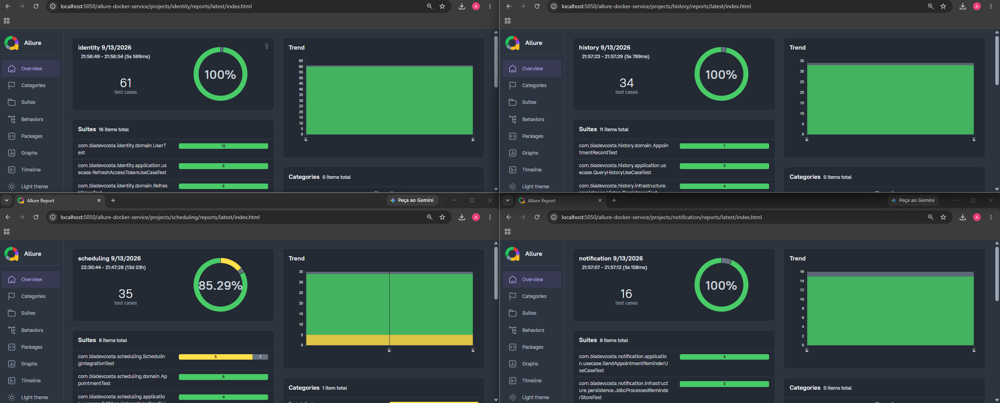

> Rodou os testes de novo? O container detecta sozinho e regenera o relatório — só dar F5.
> Os resultados se acumulam entre execuções; pra ver só a rodada mais recente, apague a
> pasta antes: `rm -rf <service>/allure-results` (bash) ou
> `Remove-Item -Recurse -Force <service>/allure-results` (PowerShell).